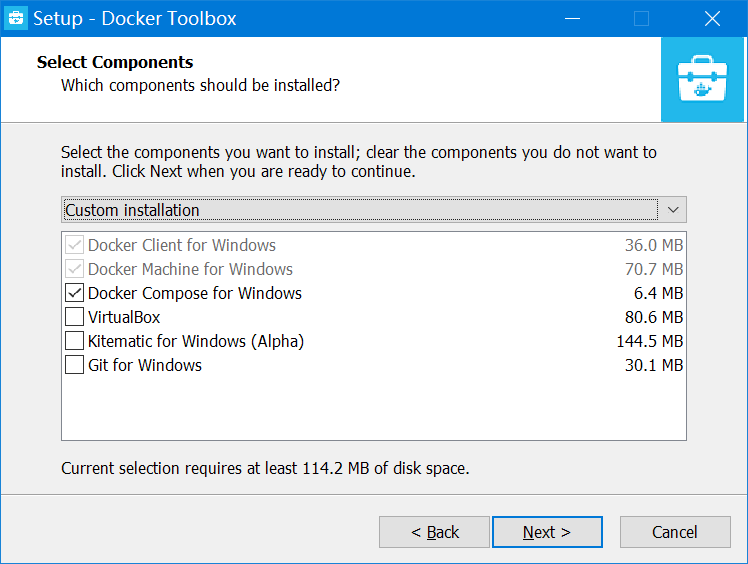
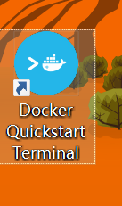
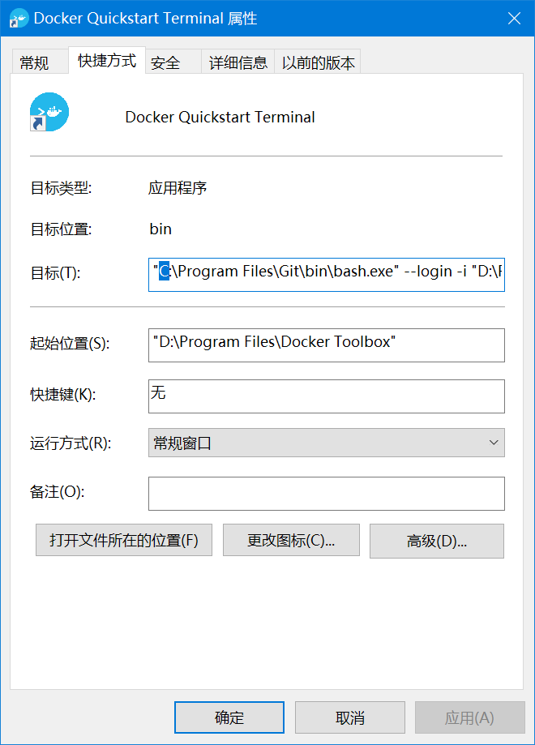
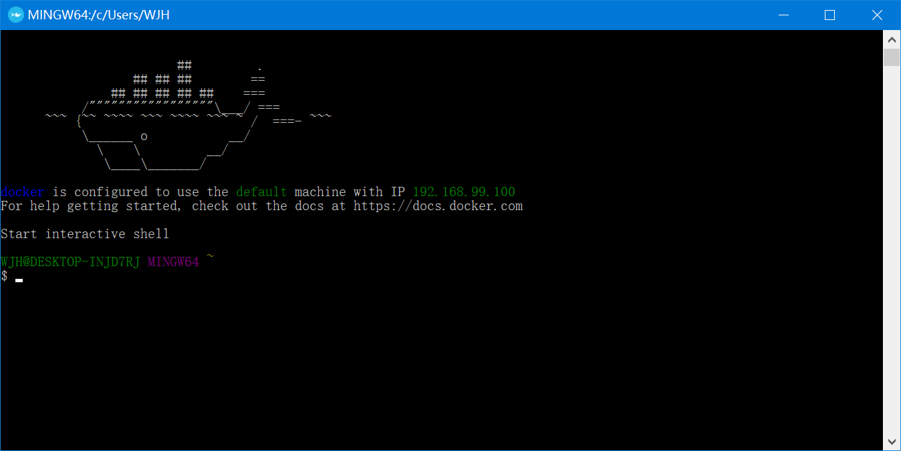
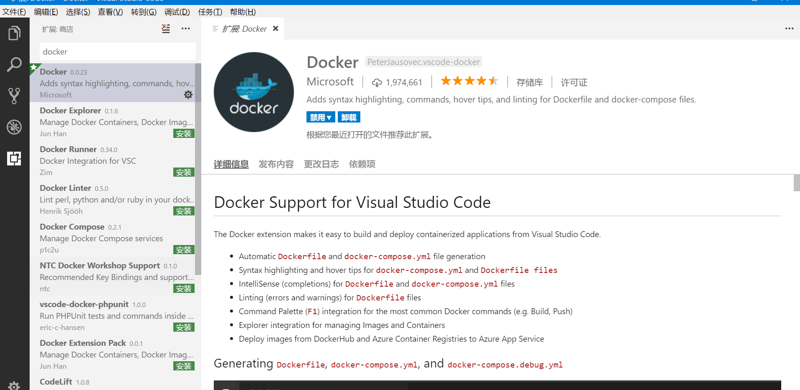
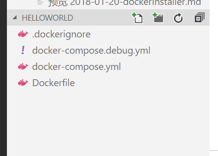
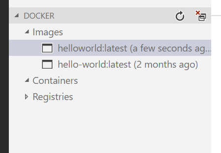

# Docker在win10 home版下安装


　　由于有正式版的win10 home许可，不想升级专业版或其他的了，于是测试在win10 home版下安装docker
　　**注意：**本安装只适用于不想升级home版的，非home版可直接安装 docker for windows，这也是官方推荐的。

<!-- more -->

## 1. 准备

　　按照git和virtualbox为非必选，因为toolbox也自带一套，不过想单独使用git或virtualbox的话建议单独安装。

### 1.1. 安装git

　　docker必须安装
　　[git下载地址](https://git-scm.com/downloads)

### 1.2. 安装 virtualbox

　　由于win10 home版本没有Hyper，这里需要安装virtualbox

　　[virtualbox下载地址](https://www.virtualbox.org/)

### 1.3. 安装 dockertoolbox

　　现在docker官网上直接下载的 docker for windows 是需要高级的windows版本的（应用了Hyper,home版不支持）。win10或其他windows的home版系统只能通过docker toolbox安装

　　[toolbox下载地址](https://download.docker.com/win/stable/DockerToolbox.exe)

　　安装时可选（如果上面没有安装git和virtualbox，这里可以选上）



## 2. 配置

### 2.1. 初始化

　　按照完毕后桌面上会出现快速启动的图标



　　如果git没有按默认安装到c盘，这里会启动错误，需修改这个快捷方式的属性。



### 2.2. 修改源

　　找到 *C:\Users\{用户名}\.docker\machine\machines\default\config.json*

　　找到 RegistryMirror，添加

``` json
"RegistryMirror": [
                "https://docker.mirrors.ustc.edu.cn/"
            ]
```

　　重启系统

### 2.3. docker启动

　　双击运行快速启动，第一次启动会更新文件，反应会比较慢，或者失败，可以再试一次，再不行的话可以去直接找国内镜像。

　　docker启动后会出现鲸鱼的标志



　　这时就可以对docker进行操作了，如果需要直接在cmd下操作，还需在环境变量里添加下面内容

| 项目                | 值                                                       |
|:--------------------|:---------------------------------------------------------|
| DOCKER_HOST         | tcp://192.168.99.100:2376                                |
| DOCKER_CERT_PATH    | C:\Users{这里改成用户名}.docker\machine\machines\default |
| DOCKER_TLS_VERIFY   | 1                                                        |
| DOCKER_MACHINE_NAME | default                                                  |

　　这时，cmd或powershell里面直接运行了。

## 3. VSCode管理Docker

　　VSCode是个神奇的东西，这个竟然也能维护。

### 3.1. 安装插件

　　首先要安装插件，直接在扩展里搜索docker，直接安装即可。



### 3.2. 建立dockerfile

　　确定能正常连接后可用插件建立dockerfile。
　　按 F1 键,输入docker add docker files to workspace, 这里提供了几个模板，部署用的，这里测试，做个helloworld，用other就可以了。后面输入ip，我这里改成8000。

　　修改Dockerfile，写简单点

``` log
FROM hello-world
LABEL Name=helloworld Version=0.0.1
```

　　在dockerfile上右击，选择buildimage，helloword会直接下载。



　　完成后右击新建的image，选择 run interactive



　　下面的终端会显示

``` log
PS D:\Docker\helloworld> docker run --rm -it helloworld:latest

Hello from Docker!
This message shows that your installation appears to be working correctly.

To generate this message, Docker took the following steps:
 1. The Docker client contacted the Docker daemon.
 2. The Docker daemon pulled the "hello-world" image from the Docker Hub.
    (amd64)
 3. The Docker daemon created a new container from that image which runs the
    executable that produces the output you are currently reading.
 4. The Docker daemon streamed that output to the Docker client, which sent it
    to your terminal.

To try something more ambitious, you can run an Ubuntu container with:
 $ docker run -it ubuntu bash

Share images, automate workflows, and more with a free Docker ID:
 https://cloud.docker.com/

For more examples and ideas, visit:
 https://docs.docker.com/engine/userguide/

PS D:\Docker\helloworld>
```

　　基本完成部署。
