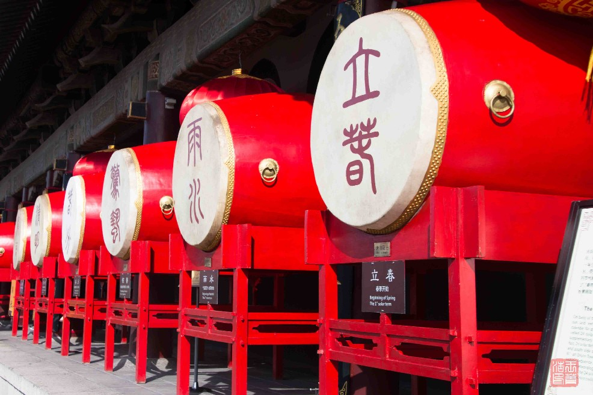

# 2018年十一西安旅游

　　今年十一去了西安旅游一周，感受了一下十三朝古都的魅力。照的照片相机里都快塞不下了

<!-- more -->

## 1. 相关行程

* 时间： 2018-9-30 ~ 2018-10-7 共7天
* 交通： 高铁
* 花费： 暂时没算

## 2. 过程

### 2.1. 九月三十日

　　下午坐高铁到西安，时间太晚了，直接入住酒店，途中路过华山，远望了一下

### 2.2. 十月一日

　　早上吃的回民的胡辣汤，肉夹馍，味道不错。然后去了西安钟楼鼓楼。钟楼是中心，鼓楼没在中轴线，在钟楼偏西，和北京的不太一样。然后去碑林博物馆附近的街道转了圈，走到了南门（永宁门），上了城墙，走了一段，在含光门下来。含光门有个博物馆，里面正在展览，展览名称叫“和合之美”,里面有很多古代的精巧盒子。中午去回民街副街吃了牛肉泡馍，手掰半个多小时，手指甲疼啊……。下午去了大雁塔，当年玄奘译经的地方，傍晚看了音乐喷泉，很壮观。

### 2.3. 十月二日

　　去了西安的东线，主要游览骊山、华清池、兵马俑，人暴多。
　　早上一大早去火车站坐专线的公交车，比较便宜，发车也比较快。先到的华清宫（华清池+骊山），本来想找电子导游器，不过没找到。先坐缆车上山，上面有鸟语林，竟然有孔雀和鸵鸟。山上还有其他一些景点。下山去了华清池。转了大概半天。下午去的兵马俑，兵马俑有电子导游，租金30，押金100。兵马俑的票包括兵马俑和地宫两个景点的，时间不够，就没去地宫那边。去兵马俑的人实在太多了，挤啊，一号坑人最多，排很长时间才看到了传说中的兵马俑。然后二号坑，三号坑，东西都不算多。晚上10点才回西安。去地时候一人一座，回来挤满了一车人，很闷。

### 2.4. 十月三日

　　去了大唐芙蓉园，地方比较大，休闲式的转了一天，演出很多，不知道日常就那么多还是因为十一的关系。下午就出来了（其实该下午转，晚上看夜景，大唐芙蓉园晚上24点才闭园）。然后去钟鼓楼看夜景。夜景很漂亮，不过遗憾的是没拿三脚架，夜景拍的不怎么样……

### 2.5. 十月四日

　　去的西安的西线，人比东线少点。西线的景点特点是景点分散。原本计划租车去乾陵，不过由于没租车经验，最后还是报的一日游。线路是： 汉景帝的汉阳陵 -> 乾陵 （包括懿德太子墓）-> 宝鸡的法门寺。报团的好处是有导游，可以了解很多知识。
　　阳陵据介绍是唯一开放陪葬坑的景点，陪葬坑上铺的玻璃，可以看到下面的各种俑，器物等，地方不大，很快就转完了。
　　然后去的乾陵景区的懿德太子墓，乾陵是当地村民自己管理的景区，有历史原因。懿德太子墓比较出名的是上过国家宝藏的壁画。现在在陕西历史博物馆里，应该是在壁画馆，票价比较贵，没看到真迹。随后去的乾陵，见到了以前在电视里看到的无字碑，无字碑现在已经被历代文人墨客刻满了字，当然，也有一些不道德游客刻的。另一侧是述圣纪碑（七节碑），由于时间太长，上面的金子已经模糊不清了。
　　最后去了法门寺，原本不在计划之内，可能是与佛有缘吧。这次去看到了释迦摩尼的佛骨舍利，听到了关于真身舍利的传奇故事。
　　回酒店又是10点以后了，这天的旅行比较特殊，几乎没怎么拍照。

### 2.6. 十月五日

　　上午去的大明宫遗址。主要景点是博物馆，讲了唐代的历史。园区不小，有环线车，能很快转玩。下午去的小雁塔，现在是西安博物馆的一部分，用身份证换票就可以进入，院子里人多，但是显得很幽静。晚上去的大雁塔南面的大唐不夜城，有音乐学院的老师学生演奏各种乐器，很是享受，听小提琴演奏小夜曲，很优美。夜景灯光也很漂亮。

### 2.7. 十月六日

　　西安旅行的最后一天去的陕西历史博物馆，排队出了名的长。早上7点到的，结果已经排出很长队了，据说前面的早上4点就来排队了。排队时有很多贩卖地图，相册的，比较有意思。排到9点多，才进到馆里，租了电子导游，也是30租金，100押金。它的电子导游和其他地方的不太一样，需要自己输入在展牌边上的号码。不过内容很丰富。
　　游览时先去的6展馆，展览的各种雕刻的玉器（大部分是近现代的），很是漂亮。然后按 1-3 展馆看相关展品。按历史排的，相当丰富。很精彩。最后去4展馆看大唐遗宝馆，看到了镇馆之宝“镶金兽首玛瑙杯”，很是漂亮。转到了快下午，直接回酒店休息。

### 2.8. 十月七日

　　早上坐车回北京，一大早西安地铁还没开，只能打车了。

## 3. 简单总结

　　这次旅行很充实，提前一个月计划的。走路比较多，最好穿合适的鞋子（我穿的登山鞋，鞋底那个硬啊，走路比较累）。西安主要是文化旅游，条件允许最好找导游或电子导游。不然只能是走马观花。
