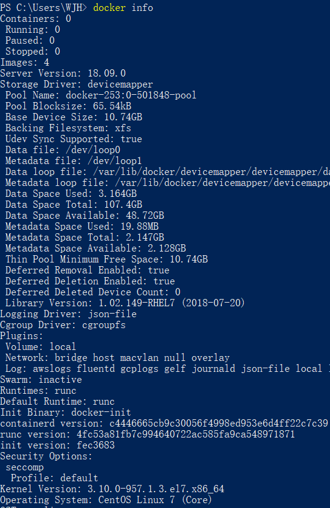
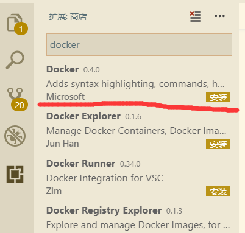
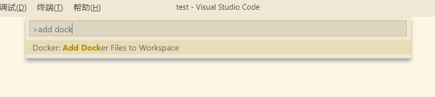
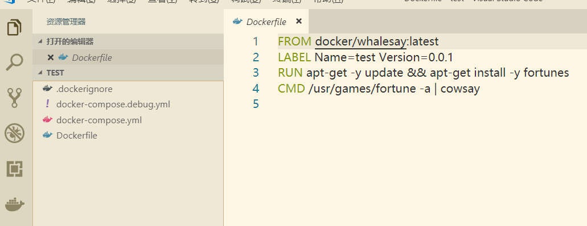
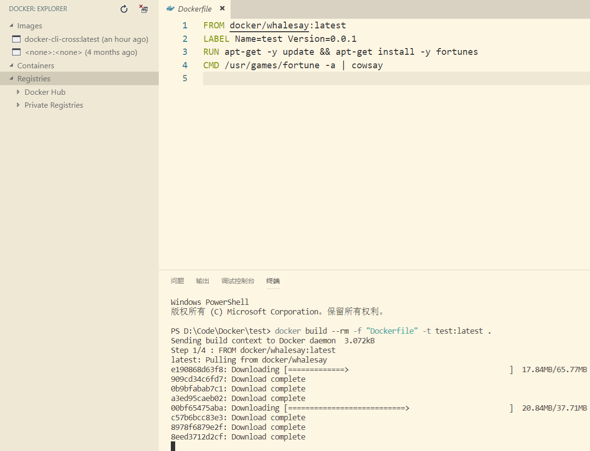
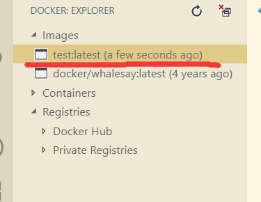

# Windows上用VSCode远程Docker


　　Windows下安装docker坑实在时太多，安装完成后其他虚拟机基本上没法用。
　　VSCode中有docker的插件，正好利用一下。
　　**注意：**此方法只适用于开发环境
<!-- more -->

## 1. 环境需求

* Windows环境
* 安装好的docker，开启2375端口

**注：**：docker 如何开启2375端口需要根据不同环境的docker分别配置，验证方法为访问 **http://{IP}:2375/info ** 如果返回相应信息，则证明开启成功

## 2. docker客户端编译

由于docker官网上只有 docker-ce 桌面版的安装包，需要编译一下客户端。

### 2.1. 编译准备

下载源码，下面的路径是v18.09版本的，如果有新版本可按需下载源码。
[docker客户端源码位置](https://github.com/docker/cli/tree/v18.09.0)
源码解压到docker服务器机器的root目录下，目录为 **/root/cli-18.09.0**（这里可按需放置）

### 2.2. 编译客户端

进入到cli-18.09.0目录，执行下面语句：

```bash
make -f docker.Makefile binary-windows
```

docker编译会自动下载需要的依赖，编译还算比较快，大概几分钟就可以（这里得看网络速度）

过程中可能会出现由于权限问题不能读取  *./scripts/xxx* 的情况，可以直接把 ./scripts 的权限改成 o+rwx

编译完成后会在 **./build** 文件夹下生成 **docker-windows-amd64** 文件，拷贝到windows上，修改名称为**docker.exe**

### 2.3. 编译后文件下载

编译后的 docker.exe 我放到了网盘，不想编译的可以直接下载

[docker.exes 下载](https://pan.baidu.com/s/15YmThw4O_WStsou7hO0kKg) 
提取码：ersy

## 3. Windos配置

### 3.1. docker环境配置

在环境变量中添加 **DOCKER_HOST** ，值为： **tcp://{IP}:2375** IP按需写
把刚才的docker.exe放到环境变量的path中

在cmd中执行 **docker info** 命令，如果能返回server的信息，则证明配置成功。


### 3.2. 配置VSCode

搜索安装docker插件


### 3.3. 测试执行 dockerfile

在VSCode中添加文件夹（为了好整理）
按 Shift + Ctrl + P 选 add docker file



由于是测试，都用默认参数即可


点右键选择 buildimage




docker就可以直接在VSCode中进行管理了。
**注：** VSCode中的Docker插件也有类似 DOCKER_HOST 的配置，但是那个配置不能写 *tcp://*，只写ip和端口即可。
