# 对 Gitlab flow的理解及在IDEA上的使用

最近一段时间很忙，没空写东西。今天整理一下Gitlab flow相关的东西，都是个人理解，如有错误，请指正。

<!-- more -->

## Gitlab flow 介绍

懒得细写了，大家直接看这里吧：[官方介绍](<https://docs.gitlab.com/ee/workflow/gitlab_flow.html>)

### 重要特点

* 分支主要有主分支（master）、功能分支、发布分支组成
* master为保护分支，只有主程序员或所有者有权限修改
* 如果有修改需从主分支分出一个分支，修改完成后再由主程序员合并到主分支中
* 发布为由上至下发布，即为主分支把需要修改的部分挑选出重要的合并到发布分支中

### 建议

* 不到必要时不要建立发布分支，减少修改
* 提交内容细化，定位要精确，
* 提交要按一定格式，方便查看

### 流程说明

举个栗子：

需在环境中添加某个功能 A，则需要如下操作：

1. 主分支分出一个功能分支，记作 *add_a*
2. 在 *add_a* 分支中添加A功能，commit并push到gitlab
3. 创建合并请求
4. review代码并由主程序员合并到master中
5. 删除Gitlab上的 *add_a*  分支，防止混乱

接着是发布流程，假设有发布分支 v1，需要把部分新加的功能放到v1中：

1. 检出 v1 分支
2. 执行 cherry-pick 命令，把要添加的commit放到 v1 分支中
3. 提交并发布 v1 分支

## 在IDEA中的使用

使用的IDEA版本为 社区版 2018.3

### 插件安装

* Git Commit Template

这个插件可以规范commit格式

### GitLab环境说明

测试环境中有3个用户，root、devs、maindev

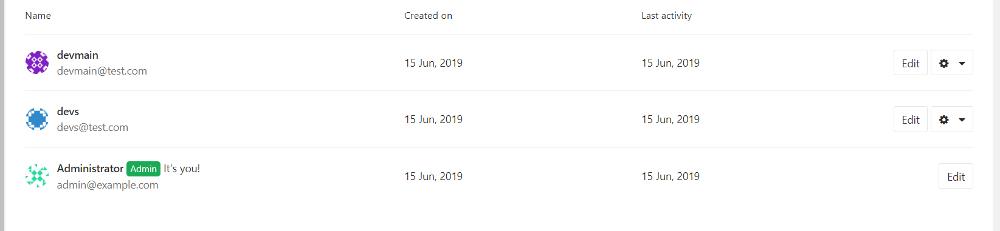

在 maindev 中创建group，并在group中创建工程 gitlabflow，在工程设置中添加devs为开发者

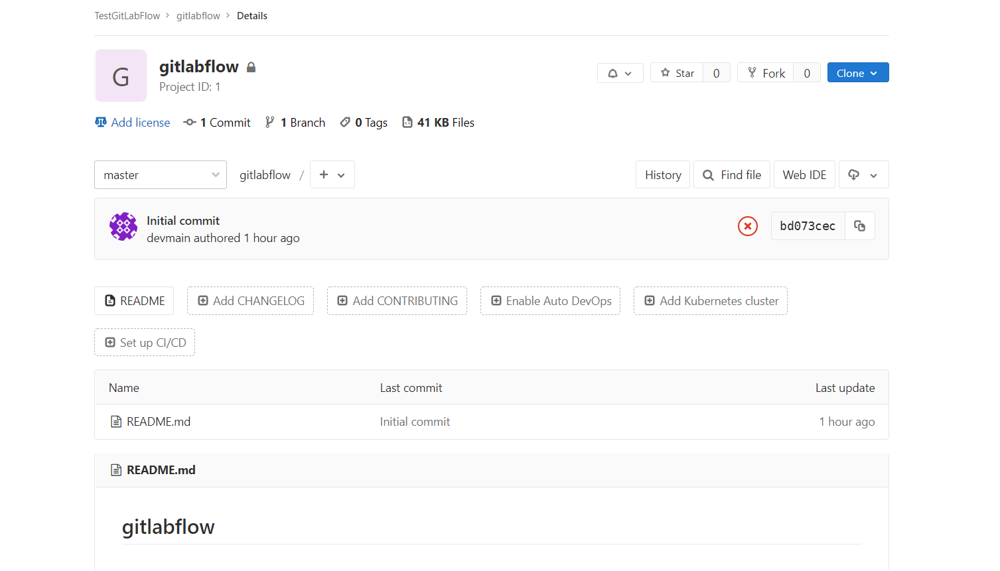

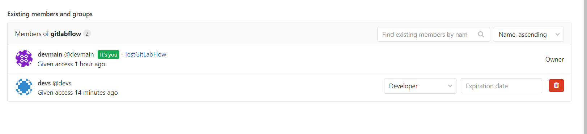

编辑 readme，写上初始版本

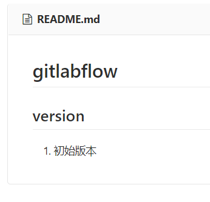

添加新分支 v1.0 作为发布分支

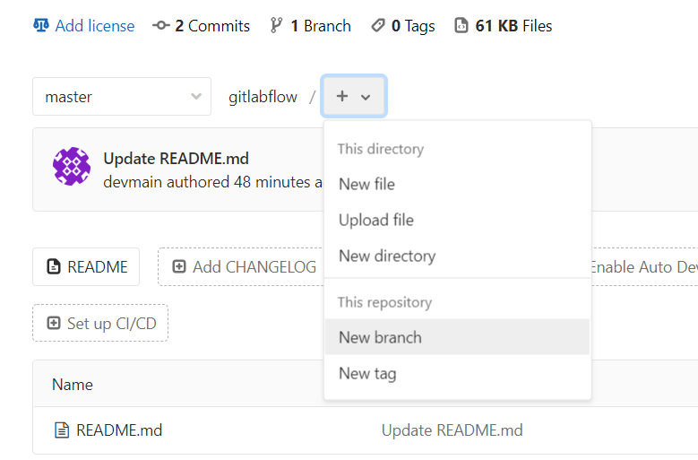

### IDEA操作

打开idea，在开始页面里clone出刚才建立的项目。打开项目后在界面右下角点开 Git: master

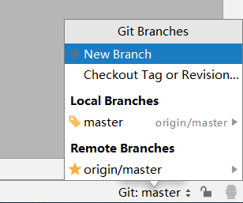

选择 New Branch，填写名称 add_a，建立好后，在 README.md 中添加内容

（里面也添加了.gitignore，看着舒服点，不是重点）

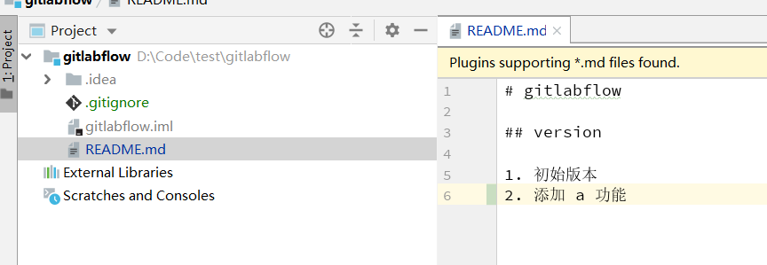

执行commit，这里注意，要用到上面提到的插件了

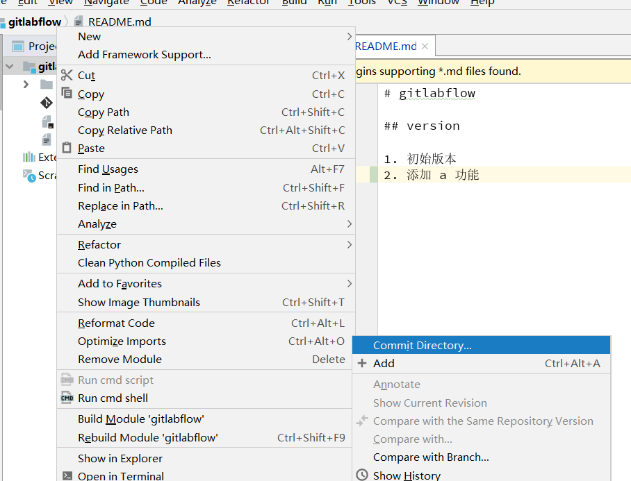

点击模板按钮，按情况填写要提交的内容，具体项目代表的内容及该填什么看这里： [angular commit template](<https://github.com/angular/angular/blob/master/CONTRIBUTING.md>)

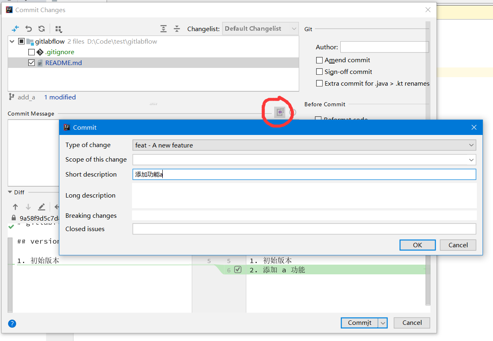

commit完成后发现原逻辑b有bug，则再从master导出一份分支，fix_b_bug

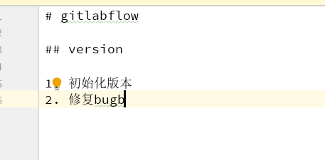

再次提交

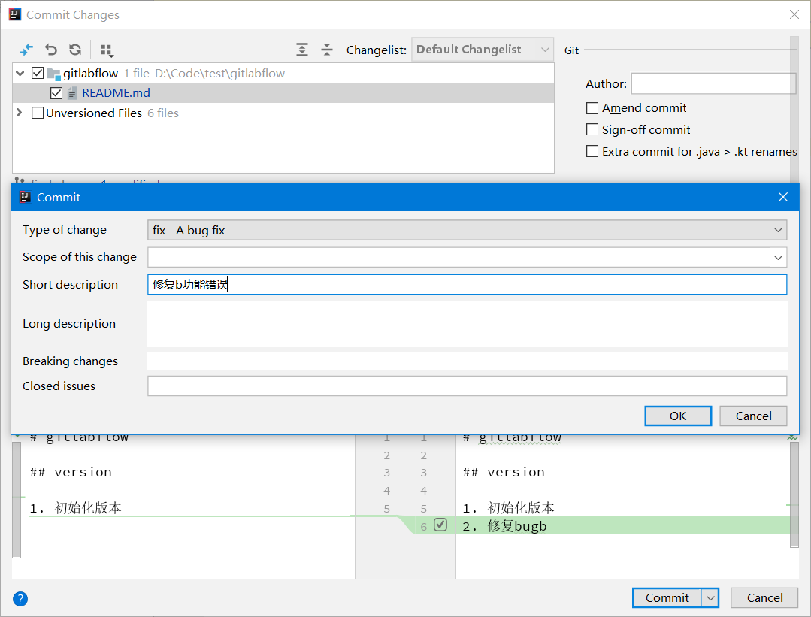

### Gitlab的合并请求处理

把2个功能分支都push 到 gitlab，登录gitlab，分别提交合并请求

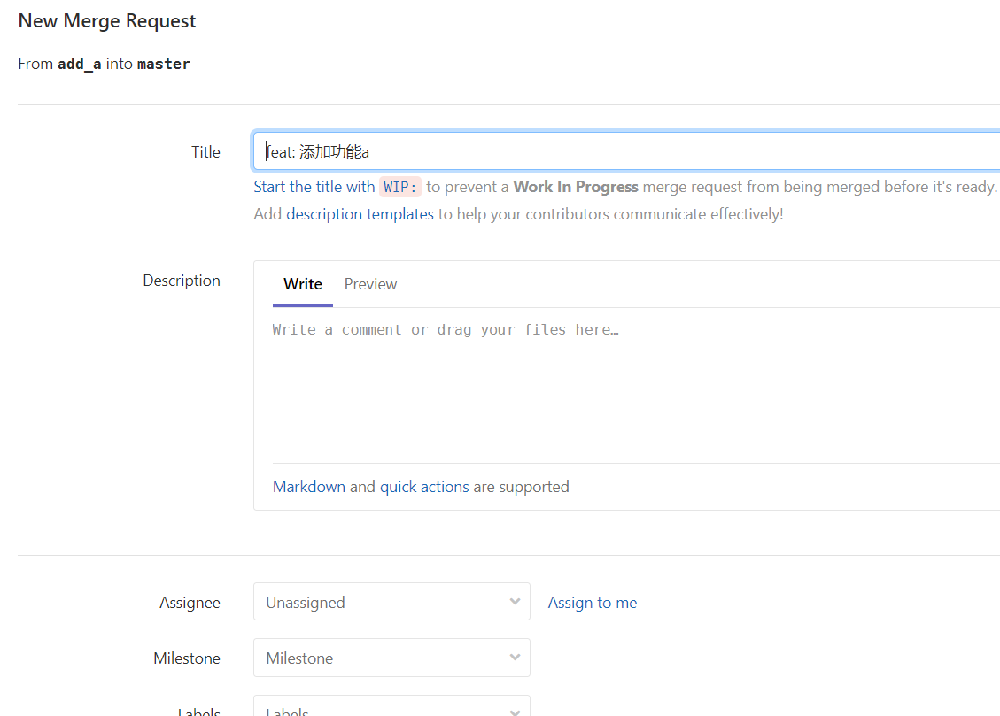

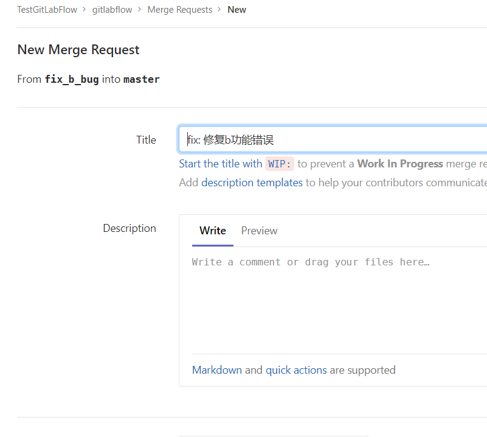

进入主程序员页面，就会发现刚提交的两个请求，比较简单，就直接merge了，merge时会有个冲突，直接修改就可以了，很简单。

merge完成

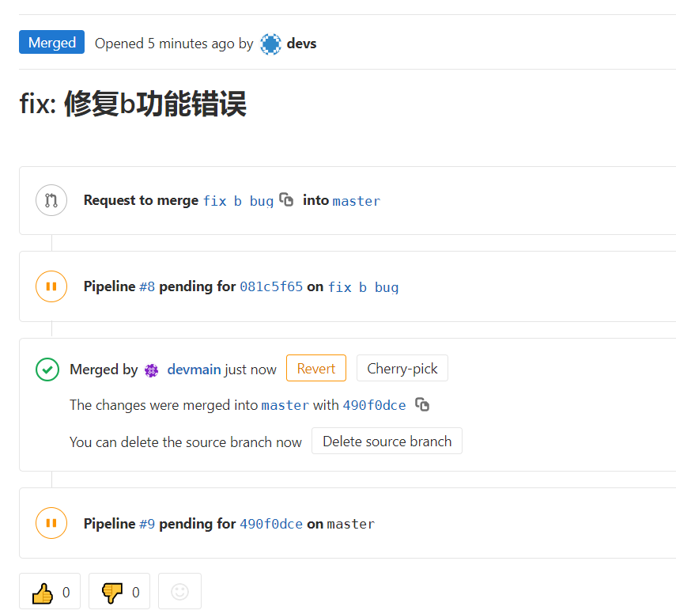

完成后**删除两个功能分支**，非特殊情况不要保留已经合并的分支

### IDEA更新

idea上更新代码，master使用pull即可，本地功能分支在master执行pull后也可删除

### 发布版本

现在模拟这样的情况，在 v1.0 版本中，不添加a功能，只修复b功能bug，可以进行下面的操作，回到IDEA，先把  v1.0 版本clone下来，此时右下角没有 v1.0 可用 Fetch 刷新

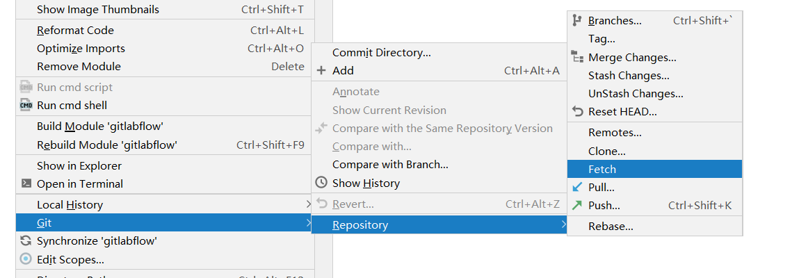

在点击右下角的状态，chechout 出 v1.0

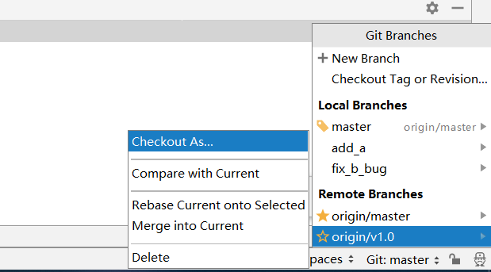

这时点开git的历史纪录

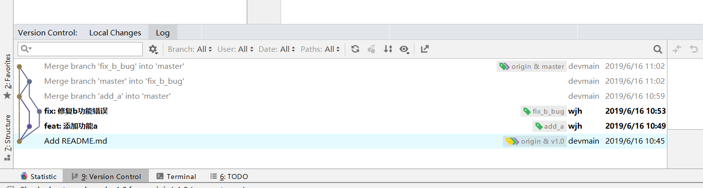

右击 fix ：修复b功能错误，点击 Cherry-Pick 

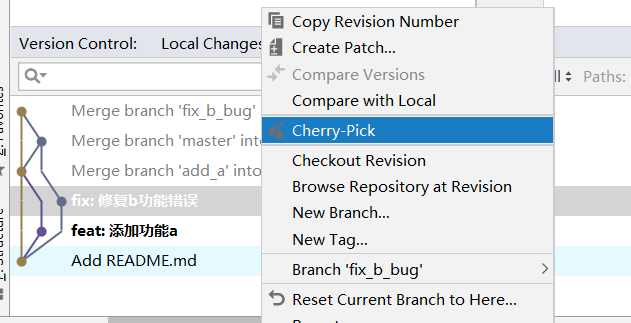

会自动弹出提交修复，提交即可完成

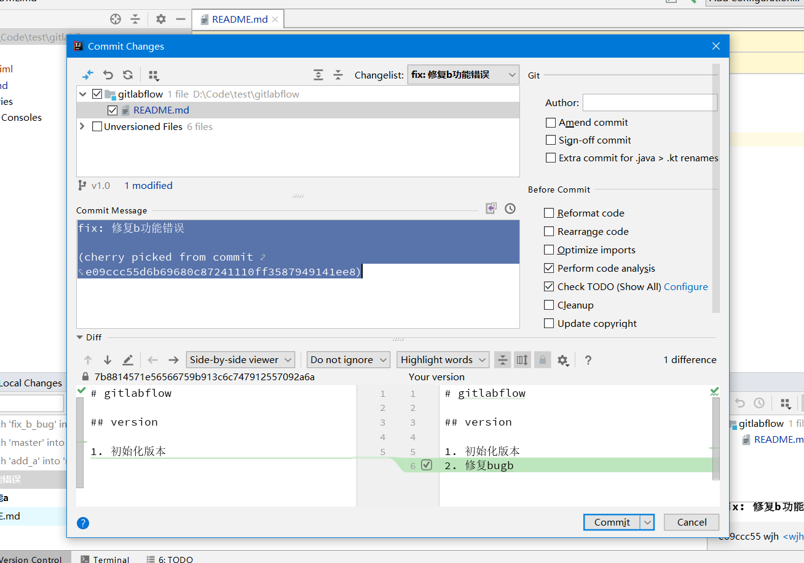

此时的 v1.0 版本就是想要的结果

## Gitlab flow 使用总结

* 功能分支尽量不要有继承关系
* 和svn或gitflow等发布方向不同，为自master向下，需要注意
* 提交格式必须规范化，方便查找
* 提交精度必须要高，少量多次

能想起来的就这么多了，以后有问题再写

