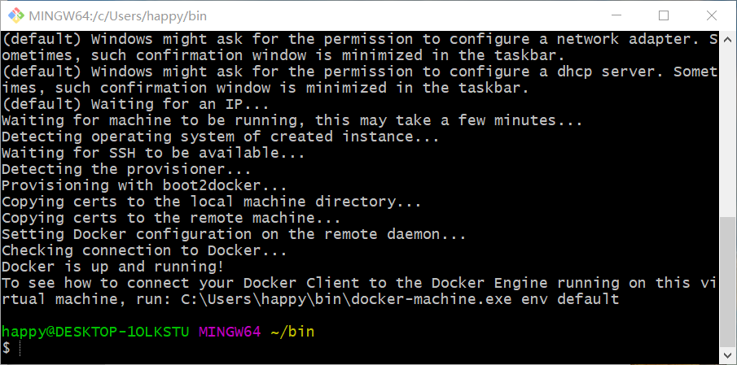
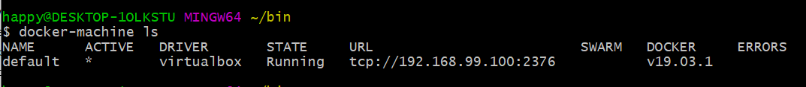
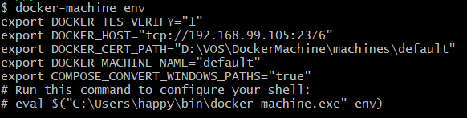
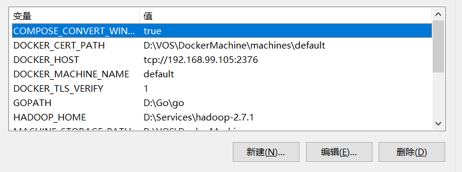

# 在windows上使用dockermachine创建docker


以前写过直接在windows下安装打包好的安装包 [详见这里](https://wjhdec.github.io/post/2018-01-20-dockeronwin10/)，这种方式依赖过多，安装时可能或多或少影响现在的环境。这次直接用 docker-machine 安装，很大程度上避免这些问题。

<!-- more -->

## 环境准备

* Windows 环境
* [Oracle VM VirtualBox](<https://www.virtualbox.org/>)
* [Git](<https://git-scm.com/>)
* LInux环境（编译客户端用，如果能找到客户端就不用编译了）

## Docker-machine 安装

可以按[官网说明](https://docs.docker.com/machine/install-machine/)安装，用 git bash 运行

```bash
$ if [[ ! -d "$HOME/bin" ]]; then mkdir -p "$HOME/bin"; fi && \
curl -L https://github.com/docker/machine/releases/download/v0.16.2/docker-machine-Windows-x86_64.exe > "$HOME/bin/docker-machine.exe" && \
chmod +x "$HOME/bin/docker-machine.exe"
```

此处可把 *$HOME/bin/* 路径添加到环境变量

用下面方法查看是否可用

```bash
docker-machine  --version
```


## Docker 客户端获取

由于docker-machine只是创造了docker虚拟机环境，还需要本地有个docker客户端。下载好对应版本，复制文件到 *$HOME/bin/* 并改名为 docker.exe

### 直接下载编译好的

直接从这里下载，但是不一定是最新版本  https://github.com/StefanScherer/docker-cli-builder

### 源码编译

由于使用的 makefile 推荐使用linux编译

git clone [源码](https://github.com/docker/cli/tree/master)

checkout 到想要编译的版本，执行下面语句或看源码说明编译

```bash
make -f docker.Makefile cross
```

这样在当前文件夹下会生成build文件夹，build文件夹中会有 docker、docker-linux-amd64、docker-windows-amd64 等一些文件，其中docker-windows-amd64就是windows中要使用的docker文件。

拷贝出 docker-windows-amd64 文件到 *$HOME/bin/* 并改名为 docker.exe

执行 docker --version 查看是否部署成功

## 创建前配置

可在环境变量中设置 *MACHINE_STORAGE_PATH* 来指定默认环境生成地点


## Docker-machine 创建

以下环境都在 git bash 下运行

### virtualbox 创建

```bash
docker-machine create --driver virtualbox default
```

过程中需进行几次权限认证



查询已有的 docker 情况（版本号和创建时相关）



```bash
docker-machine env [如果不是default，这里需写上名称]
```

显示相关信息



此时如果在 git bash下执行提示中的语句，则在本进程中docker可用，但是重新打开的话需要重写。比较好的方式是直接写到环境变量中。



这样在 git bash 或  powershell 中都可使用

测试 docker images 即可查看现有 images
