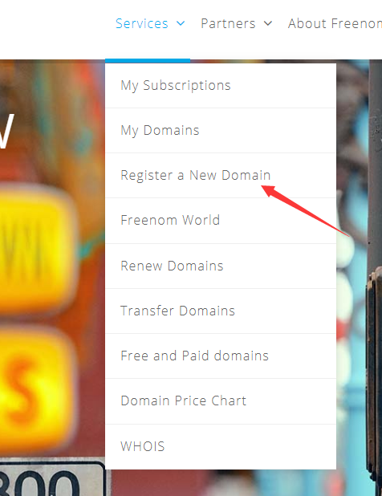
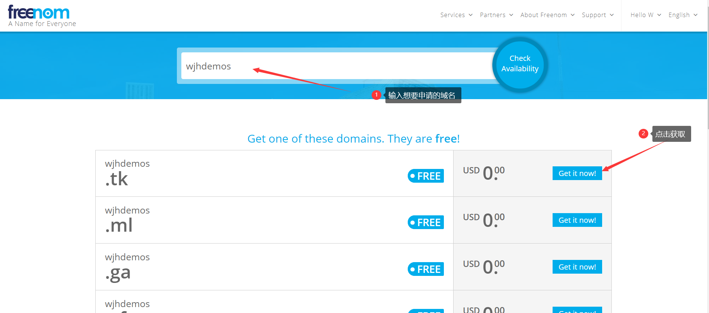
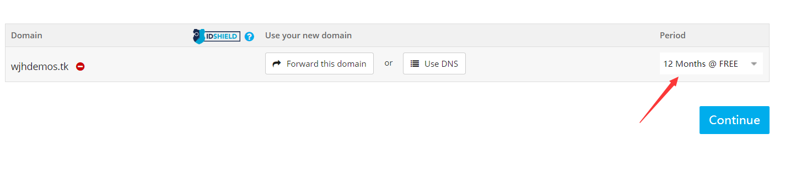
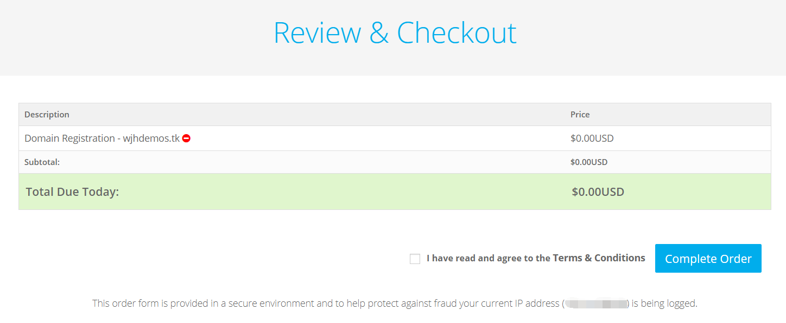
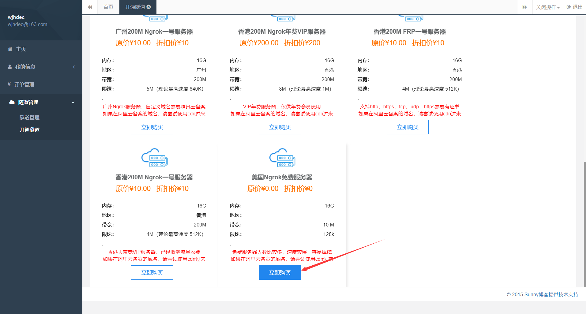
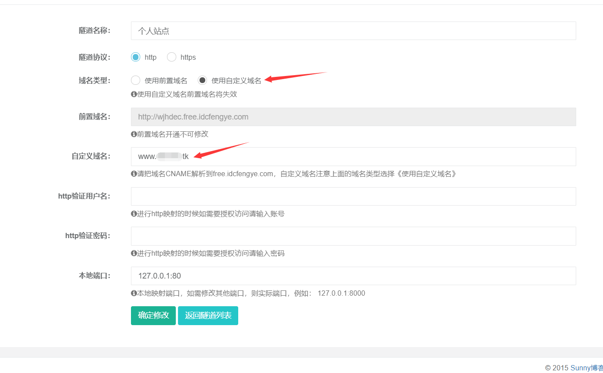
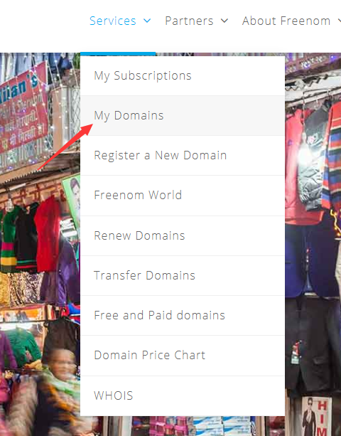
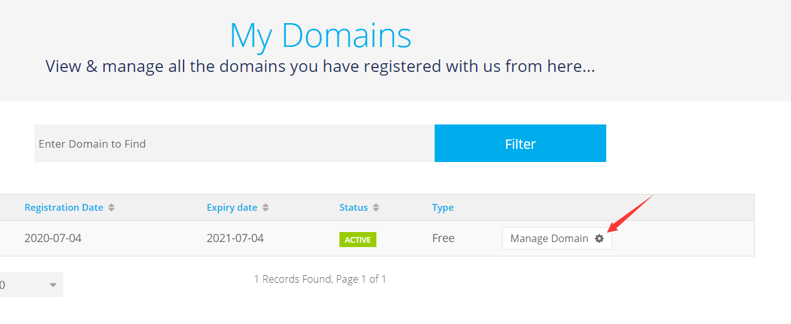
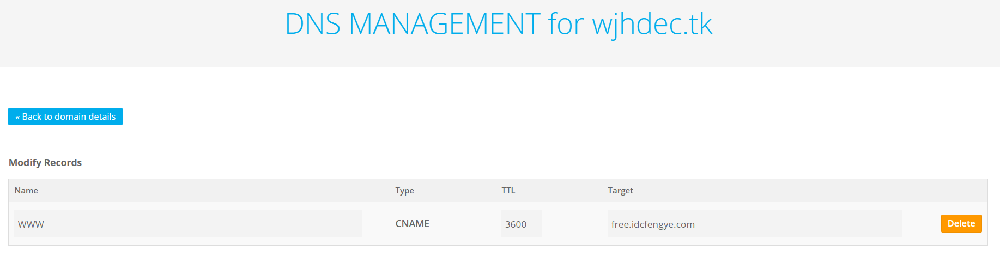

# 树莓派部署免费公网站点


树莓派买来闲置有段时间了，搭一些简单的服务有点浪费，这次准备用起来

## 配置树莓派

### 安装服务

这里选择了比较简单的 `nginx-light` 有其他需求也可以部署apache，tomcat 等

安装nginx

```bash
sudo apt install nginx-light
```

设置自启及启动

```bash
sudo systemctl enable nginx
sudo systemctl restart nginx
```

### 建立测试网页

新建测试页面

```bash
sudo mkdir -p /var/www/html/demo
sudo sh -c 'cat > /var/www/html/demo/index.html << EOF
<html>
  <body>
  <header>hello my site </header>
  </body>
</html>
EOF'
```

```scala
def flatMap[B, That](f: A => GenTraversableOnce[B])(implicit bf: CanBuildFrom[Repr, B, That]): That = {
    def builder = bf(repr) // extracted to keep method size under 35 bytes, so that it can be JIT-inlined
    val b = builder
    for (x <- this) b ++= f(x).seq
    b.result
}
```

```java
@Test
public void testStream(){
    List<List<String>> demo = Arrays.asList(
        Arrays.asList("a","b"), 
        Arrays.asList("c","d"));
    List<String> result = demo.stream()
        .flatMap(Collection::stream)
        .collect(Collectors.toList());
    result.forEach(System.out::print);
}
```


然后可以访问一下  http://{树莓派IP地址}:80/demo  ,如果正常出现 hello my site 证明部署成功。

## 申请免费域名

从[freenom](https://my.freenom.com/clientarea.php) 申请免费域名，这个网站最好翻墙进去，否则特别容易卡死。

首先注册账号，或者直接用google账号登陆，我比较懒，直接用google账号了。








这里默认是3个月，最多可选择12个月





这里有个坑，后来发现是代理问题，不要用浏览器代理，可以设置成系统代理，然后在浏览器级别设置为系统代理，再购买即可。


## 内网穿透

### 注册账户及开通隧道

内网穿透需要有公网服务器，感觉暂时买服务器没啥用，就找到了免费的 ngrok 服务 [sunny-ngrok](https://www.ngrok.cc/)，它提供了 ngrok 和 frp 服务器，但是免费的只有 ngrok

[官网教程](http://www.ngrok.cc/_book/) 建议看一下，里面有安装方法，主要看这两个： [ngrok安装](http://www.ngrok.cc/_book/start/ngrok_linux.html) 和 [开机自启动](http://www.ngrok.cc/_book/start/ngrok_auto.html) 。

[自定义域名](http://www.ngrok.cc/_book/general/hostname.html) 如果使用自定义域名，这里也建议看一下



点击开通隧道，免费的只有这个，自己玩凑合点也可以了



这里勾选 自定义域名，然后在自定义域名那里写下刚才申请的域名


这里如果使用 freenom 自己的 DNS，最好在域名前面加 www. 如果托管的其他的DNS再看情况



注意这句，等会儿要用到

[quote]
____
请把域名CNAME解析到free.idcfengye.com
____

### 客户端部署

如何在客户端部署直接看官网文档就可以了，很简单。如果修改隧道后记得重启客户端


## 设置DNS

登录 [freenom](https://my.freenom.com/clientarea.php)








注意NAME关系到使用的网址，这里好像还不支持 `@` ，就用 www 了，这也是上面填自定义域名的时候加上了 www 的原因


## 测试连接

上面的部署完成后可能不能马上测试成功，DNS需要一定时间刷新。可以过一段时间刷一下试试，测试网址 http://www.{自定义域名}.tk/demo ，如果出现 hello my site 则证明发布成功

最后可以自己在树莓派建立自己的站点了

## 进一步升级

还可以把DNS托管给 DNSpod 等，不清楚国内管理怎么样，暂时还是用freenom的DNS了

另外准备试试 [cloudflare](https://dash.cloudflare.com/login) 看能不能免费申请 https 的证书

